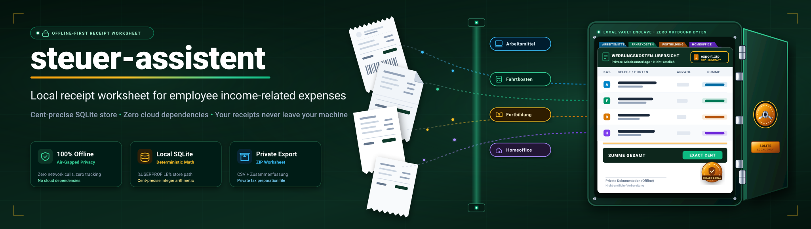
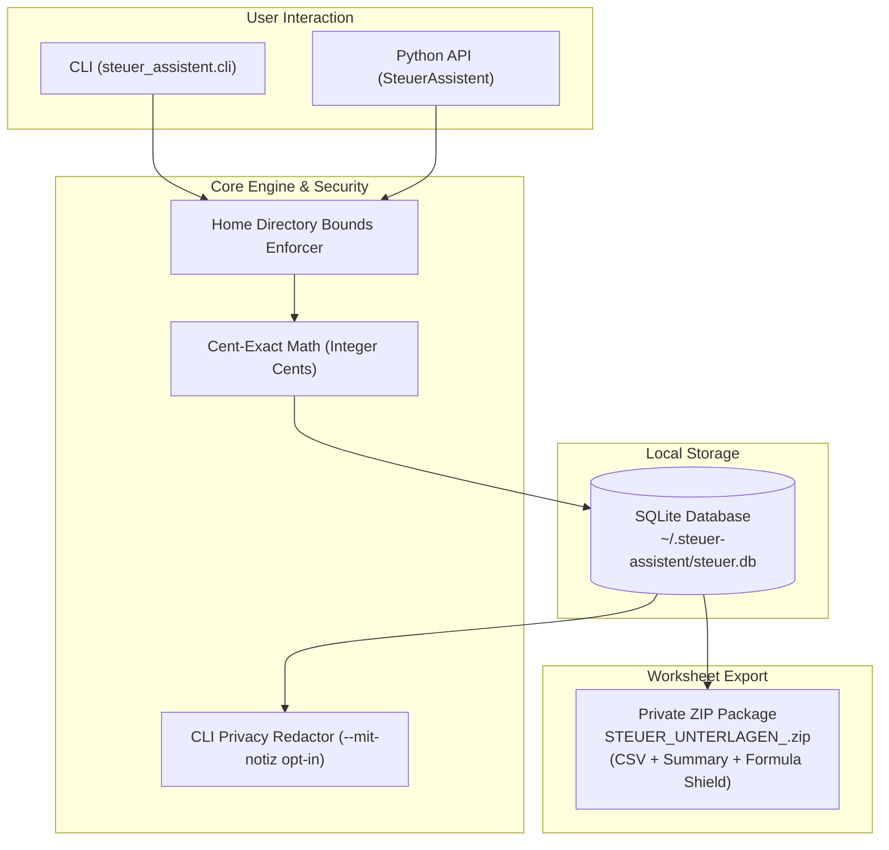
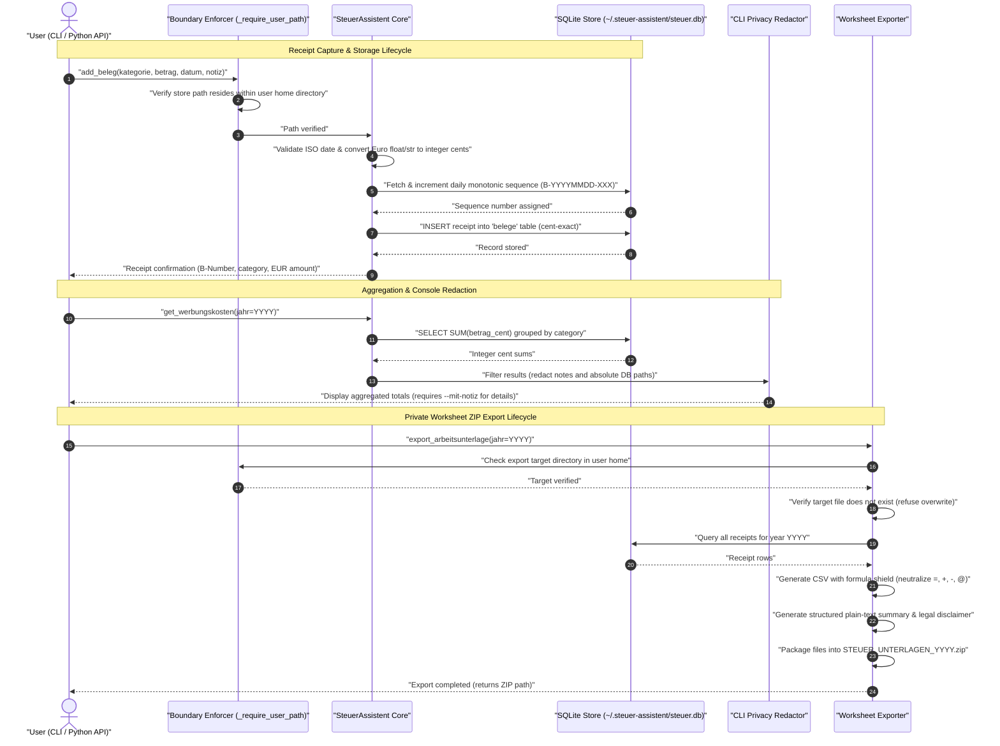

# steuer-assistent

[🇩🇪 Deutsche Version](README_de.md)

[](https://github.com/ellmos-ai/steuer-assistent/actions/workflows/tests.yml)
[](https://www.python.org/downloads/)
[](https://opensource.org/licenses/MIT)
[](#architecture)
[](#installation-and-testing)
[](https://github.com/astral-sh/ruff)
[](#store-and-data-privacy)
[](#legal-framework-and-operating-mode)
[](SECURITY.md)
[](https://github.com/ellmos-ai)
[](https://github.com/open-bricks)
[](llms.txt)
[](CHANGELOG.md)

*Local receipt worksheet for employee income-related expenses — not tax advice.*

---

### Quick Navigation

[Overview](#overview) •
[Architecture](#architecture) •
[Execution Lifecycle](#execution-lifecycle) •
[Governance Invariants](#governance-and-runtime-invariants) •
[Key Features](#key-features) •
[Usage](#usage) •
[Python API](#python-api) •
[Store & Privacy](#store-and-data-privacy) •
[Testing](#installation-and-testing) •
[Legal Framework](#legal-framework-and-operating-mode) •
[Ecosystem](#sister-repositories--ecosystem) •
[Security](#security-and-vulnerability-reporting)

---

## Overview

A lightweight, offline-first Python module for recording self-categorized receipts for employee income-related expenses (*Werbungskosten*), computing exact cent sums, and exporting private, non-official ZIP worksheet packages. It does not assess tax deductibility, nor does it prepare or submit tax returns.

Official electronic submission in Germany must be conducted via ELSTER or officially approved tax software. Note that documents uploaded to ELSTER's "Meine Belege" are not automatically submitted to the tax authorities until actively attached to an official declaration:
[ELSTER Document Management](https://portal.elster.de/eportal/helpGlobal?themaGlobal=help_meine_belege),
[ELSTER Document Submission](https://www.elster.de/eportal/formulare-leistungen/alleformulare/belegnachreichung).

> [!NOTE]
> **Offline-First & Local-Only Architecture**: `steuer-assistent` is a purely offline receipt worksheet module (`~/.steuer-assistent/steuer.db`). Zero network calls, zero cloud dependencies, cent-exact math (integer cents), and privacy-preserving CLI defaults.

## Architecture



## Execution Lifecycle



## Governance and Runtime Invariants

| ID | Invariant | Enforcement Mechanism | Verification |
|---|---|---|---|
| **INV-LOCAL-01** | Zero Egress | Pure offline execution; zero socket calls, HTTP libraries, or cloud telemetry. | Test suite & packaging audits |
| **INV-LOCAL-02** | Cent-Exact Math | Amounts stored internally as integer cents (`betrag_cent`) to avoid float drift. | `test_money_is_stored_and_aggregated_as_cents` |
| **INV-LOCAL-03** | Path Confinement | Store, linked receipts, and exports must reside strictly inside user home directory. | `_require_user_path` validation |
| **INV-LOCAL-04** | RunAsInvoker | Executes with standard user privileges; no administrator or root elevation required. | Runtime manifest |
| **INV-LOCAL-05** | Console Privacy | Notes and absolute paths redacted by default; explicit opt-in required (`--mit-notiz`). | `test_cli_redacts_notes_and_store_path_by_default` |
| **INV-LOCAL-06** | Non-Overwriting Export | Target archive check refuses overwrite, preventing accidental data loss. | `test_export_refuses_overwrite_and_leaves_no_temp_file` |
| **INV-LOCAL-07** | CSV Formula Shield | Neutralizes spreadsheet injection by prepending `'` to values starting with `=`, `+`, `-`, `@`. | `test_export_is_neutral_private_bundle_and_formula_safe` |
| **INV-LOCAL-08** | Monotonic Sequences | Receipt numbers (`B-YYYYMMDD-XXX`) are monotonic per day and never reused after deletion. | `test_numbers_are_not_reused_after_delete` |
| **INV-LOCAL-09** | Standard Library Core | Built strictly on Python stdlib and `sqlite3`; zero external runtime dependencies. | `pyproject.toml` dependencies check |
| **INV-LOCAL-10** | Security SLA | 48-hour response SLA and 5-business-day triage commitment for vulnerability reports. | `SECURITY.md` contract tests |

## Key Features

| Feature | Description |
|---|---|
| **Offline-First & Local** | Storage strictly restricted to user home directory (`%USERPROFILE%\.steuer-assistent\steuer.db`). Zero network calls. |
| **Cent-Exact Math** | Amounts are stored internally as integer cents to eliminate floating-point rounding inaccuracies. |
| **Privacy-Preserving CLI** | Notes and absolute file paths are redacted by default in console output and require explicit opt-in (`--mit-notiz`, `--mit-pfad`). |
| **Worksheet ZIP Export** | Generates `STEUER_UNTERLAGEN_<jahr>.zip` with CSV (UTF-8 BOM), structured text summary, and spreadsheet formula injection protection. Never overwrites existing files. |
| **Standard Library Only** | Requires only Python 3.10+ and standard library modules (`sqlite3`). Zero third-party runtime dependencies. |

## Usage

### Command Line Interface (CLI)

| Action | Command |
|---|---|
| Add receipt | `python -m steuer_assistent.cli add --kategorie Arbeitsmittel --betrag 49.90 --datum 2026-03-15 --notiz "USB-Hub"` |
| List receipts without notes | `python -m steuer_assistent.cli list` |
| List receipts with notes | `python -m steuer_assistent.cli list --mit-notiz` |
| Aggregate expenses for a year | `python -m steuer_assistent.cli werbungskosten --jahr 2026` |
| Export private worksheet | `python -m steuer_assistent.cli export --jahr 2026` |
| Show status without DB path | `python -m steuer_assistent.cli status` |
| Show status with full DB path | `python -m steuer_assistent.cli status --mit-pfad` |

The default export file is named `STEUER_UNTERLAGEN_<jahr>.zip`. Existing target files are never overwritten. The ZIP archive contains a CSV export, a text summary, and a legal notice clarifying non-official status, but no original receipt image files.

### Python API

```python
from steuer_assistent.core import SteuerAssistent

with SteuerAssistent() as sa:
    # Add a receipt entry
    sa.add_beleg(
        kategorie="Arbeitsmittel",
        betrag=49.90,
        datum="2026-03-15",
        notiz="USB-Hub",
    )

    # Calculate recorded expenses
    agg = sa.get_werbungskosten(jahr=2026)
    print(f"Total 2026: {agg['gesamt_eur']:.2f} EUR")

    # Export private worksheet package
    export_zip = sa.export_arbeitsunterlage(jahr=2026)
    print(f"Exported to: {export_zip}")
```

## Store and Data Privacy

- **Default Location**: `%USERPROFILE%\.steuer-assistent\steuer.db`
- **Configuration Override**: Environment variable `STEUER_ASSISTENT_DB=<path>` or `--store <path>` argument.
- **Path Confinement**: Database store, linked receipt paths, and export files must reside strictly inside the user's home directory (`_require_user_path`).
- **Currency Storage**: Amounts are stored as integer cents (`betrag_cent`); existing legacy databases are automatically migrated on startup.
- **CLI Redaction**: Sensitive notes and absolute paths are redacted from CLI output unless explicitly requested.
- **File Permissions**: Restrictive filesystem permissions are applied (`0600`/`0700` on POSIX; user profile ACLs on Windows).
- **Isolation**: Zero network requests, zero cloud syncing, zero access to external databases.

Database schema: `belege`, `beleg_sequences`, `werbungskosten_kategorien`, `export_runs`.

## Installation and Testing

```powershell
cd steuer-assistent
python -m pip install -e .
python -B -m pytest tests -q -p no:cacheprovider
```

## Sister Repositories & Ecosystem

`steuer-assistent` operates within the privacy-respecting, local-first ecosystem of **[ellmos-ai](https://github.com/ellmos-ai)** and **[open-bricks](https://github.com/open-bricks)**:

| Project | Organization | Focus | Relationship |
|---|---|---|---|
| **[assistant-core](https://github.com/ellmos-ai/assistant-core)** | ellmos-ai | Local agent infrastructure | Offline task processing & SQLite order queues |
| **[foerderplaner](https://github.com/ellmos-ai/foerderplaner)** | ellmos-ai | Educational support planning | ICF-based local educational assistance |
| **[worksheet-generator](https://github.com/ellmos-ai/worksheet-generator)** | ellmos-ai | Structured worksheet creation | Educational document generation |
| **[anonymizer](https://github.com/ellmos-ai/anonymizer)** | ellmos-ai | Privacy & pseudonymization | Redaction engine for sensitive personal documents |
| **[KnowledgeDigest](https://github.com/file-bricks/knowledgedigest)** | file-bricks | Document processing & search | Local text extraction and indexing |
| **[SoftwareCenter](https://github.com/file-bricks/SoftwareCenter)** | file-bricks | Desktop catalog & management | Unified installer and application catalog |
| **[LaunchBoards](https://github.com/file-bricks/LaunchBoards)** | file-bricks | Desktop orchestration | Workspace launcher and app profile manager |
| **[WikiStub-Seed](https://github.com/dev-bricks/WikiStub-Seed)** | dev-bricks | Knowledge base tooling | Static site and local vault generation |

## Security and Vulnerability Reporting

Security and user data privacy are core design principles:
- **Offline Guarantee**: The software never transmits telemetry, credentials, or receipts over any network interface.
- **Reporting**: Report suspected security vulnerabilities privately via [GitHub Private Vulnerability Reporting](https://github.com/ellmos-ai/steuer-assistent/security/advisories/new) or directly to `security@ellmos.ai` and `security@open-bricks.org`.
- **Response SLA**: Binding **48-hour response SLA** and **5-business-day triage commitment**.
- Full security policy and disclosure guidelines: see [`SECURITY.md`](SECURITY.md).

## Scope and Boundaries

- **Scope**: Private worksheet preparation for employee income-related expenses; no commercial or business expense workflows.
- **No Tax Advice**: No legal review, no deductibility assessment, and no individual tax consulting.
- **No Official Format**: Not an ELSTER, ERiC, or tax authority submission package.
- **No Transmission**: No automated or direct transmission to government agencies.
- **Independence**: Fully self-contained standard library tool with zero external framework runtime dependencies.

## Legal Framework and Operating Mode

**No Tax Advice.** This module is a pure self-application utility: it records and sums receipts categorized by the user, but performs no tax evaluation and provides no guarantees regarding tax recognition or deductibility. Use is at your own risk; statutory mandatory liability provisions apply under applicable law (liability for intentional misconduct and gross negligence cannot be excluded under German law pursuant to §§ 276 para. 3, 309 no. 7 lit. b BGB).

AI-assisted initial legal assessment (as of 2026-07-23, not a substitute for formal legal counsel): For the current operating mode — pure self-application on locally held data categorized solely by the user, without network communication or legal evaluation of individual cases — this tool does not constitute commercial assistance in tax matters (*geschäftsmäßige Hilfeleistung in Steuersachen*) under the German Tax Advisory Act (StBerG, esp. § 2 para. 2) or legal services under the Legal Services Act (RDG, esp. § 2 para. 1).

**This assessment applies exclusively to the described operating mode.** A new legal assessment is required if the operating mode changes — particularly in case of:

1. **Automated tax classification or evaluation** by the software itself (rather than user categorization),
2. **Hosted multi-user or service operation**, or processing third-party receipts (rather than local self-use),
3. **ELSTER, ERiC, or official tax authority submission interfaces**,
4. **Commercial marketing or paid distribution** of this module or derived pipelines,
5. **Cloud synchronization or public distribution of user database files** (which may void the GDPR household exemption under Art. 2 para. 2 lit. c GDPR),
6. **Installation on enterprise / BYOD workstations for processing employer expenses** (which may also impact GDPR household exemption applicability).

## Origin

- **Origin**: Extracted from BACH `agents/_experts/steuer/` (MIT)
- **Extraction Date**: 2026-06-22
- **License**: MIT

## License

MIT — see [`LICENSE`](LICENSE). Changes: see [`CHANGELOG.md`](CHANGELOG.md).
Security policies: see [`SECURITY.md`](SECURITY.md).
Third-Party Licenses & Invariants: see [`THIRD_PARTY_LICENSES.md`](THIRD_PARTY_LICENSES.md).
