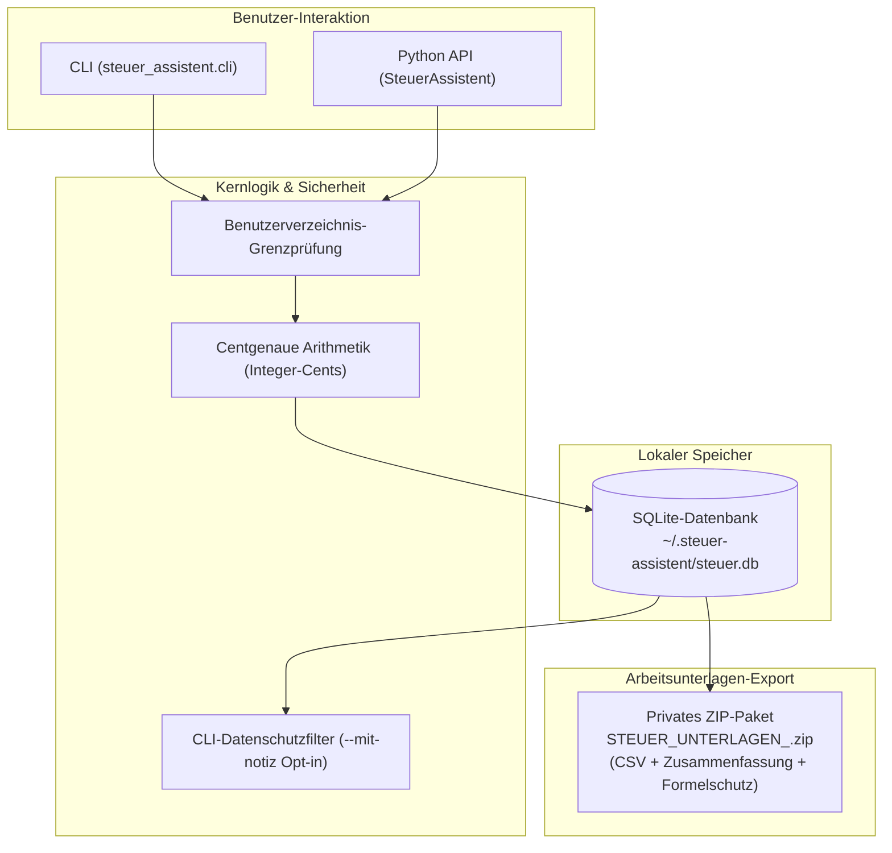
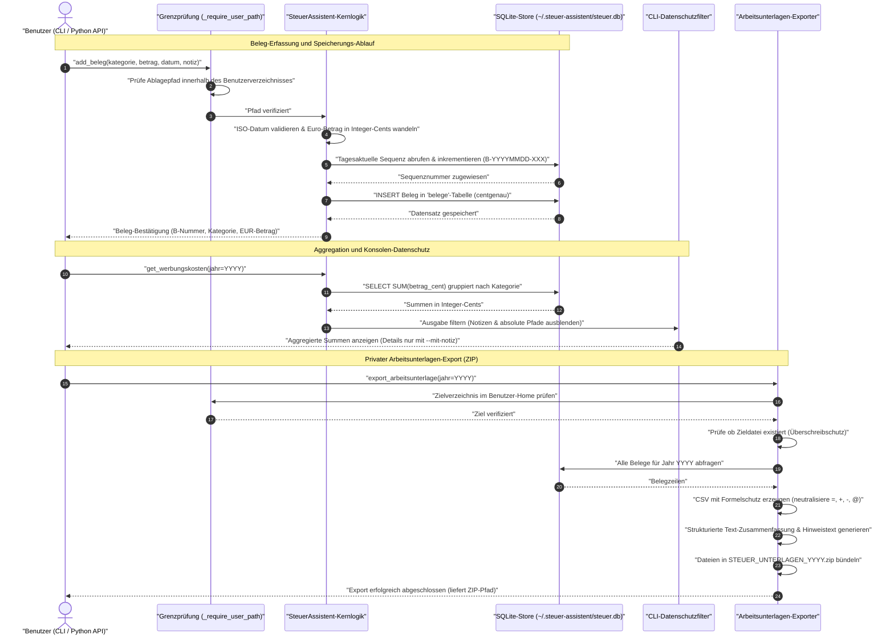

# steuer-assistent

[🇬🇧 English Version](README.md)

[](https://github.com/ellmos-ai/steuer-assistent/actions/workflows/tests.yml)
[](https://www.python.org/downloads/)
[](https://opensource.org/licenses/MIT)
[](#architektur)
[](#installation-und-tests)
[](https://github.com/astral-sh/ruff)
[](#store-und-datenschutz)
[](#rechtlicher-rahmen-und-betriebsform)
[](SECURITY.md)
[](https://github.com/ellmos-ai)
[](https://github.com/open-bricks)
[](llms.txt)
[](CHANGELOG.md)

*Lokale Beleg-Arbeitsunterlage für Arbeitnehmer-Werbungskosten — keine Steuerberatung.*

---

### Schnellnavigation

[Überblick](#überblick) •
[Architektur](#architektur) •
[Ausführungs-Lebenszyklus](#ausführungs-lebenszyklus) •
[Governance- & Laufzeit-Invarianten](#governance--und-laufzeit-invarianten) •
[Funktionsübersicht](#funktionsübersicht) •
[Verwendung](#verwendung) •
[Python-API](#python-api) •
[Store & Datenschutz](#store-und-datenschutz) •
[Installation & Tests](#installation-und-tests) •
[Rechtsrahmen](#rechtlicher-rahmen-und-betriebsform) •
[Partner-Repositories & Ökosystem](#partner-repositories--ökosystem) •
[Sicherheit & Schwachstellenmeldung](#sicherheit-und-schwachstellenmeldung)

---

## Überblick

Ein leichtgewichtiges, Offline-First-Python-Modul zur lokalen Erfassung von selbst eingeordneten Belegen für Arbeitnehmer-Werbungskosten, centgenauer Summierung und dem Export privater, nicht-amtlicher ZIP-Arbeitsunterlagen. Es prüft weder die steuerliche Abziehbarkeit noch erstellt oder übermittelt es eine Steuererklärung.

Die offizielle elektronische Übermittlung erfolgt über ELSTER beziehungsweise dafür zugelassene Software. ELSTER weist außerdem darauf hin, dass bloß in „Meine Belege“ erfasste Dokumente noch nicht an das Finanzamt übermittelt sind:
[ELSTER-Belegverwaltung](https://portal.elster.de/eportal/helpGlobal?themaGlobal=help_meine_belege),
[ELSTER-Belegnachreichung](https://www.elster.de/eportal/formulare-leistungen/alleformulare/belegnachreichung).

> [!NOTE]
> **Offline-First & Lokale Architektur**: `steuer-assistent` ist ein reines Offline-Arbeitsunterlagenmodul (`~/.steuer-assistent/steuer.db`). Keine Netzwerkaufrufe, keine Cloud-Abhängigkeiten, centgenaue Arithmetik (Integer-Cents) und datenschutzfreundliche Standardeinstellungen in der Befehlszeile.

## Architektur



## Ausführungs-Lebenszyklus



## Governance- und Laufzeit-Invarianten

| ID | Invariante | Durchsetzungs-Mechanismus | Verifikation |
|---|---|---|---|
| **INV-LOCAL-01** | Zero Egress | Vollständige Offline-Ausführung; keinerlei Netzwerkverbindungen, HTTP-Aufrufe oder Telemetrie. | Testsuite & Paketierungs-Prüfung |
| **INV-LOCAL-02** | Centgenaue Arithmetik | Beträge werden intern als Integer-Cents (`betrag_cent`) gespeichert, um Rundungsfehler auszuschließen. | `test_money_is_stored_and_aggregated_as_cents` |
| **INV-LOCAL-03** | Benutzerverzeichnis-Grenzprüfung | Datenbank, Belegpfade und Exporte dürfen ausschließlich innerhalb des Home-Verzeichnisses liegen. | `_require_user_path`-Prüfung |
| **INV-LOCAL-04** | RunAsInvoker | Läuft mit Standard-Nutzerrechten; keine Administrator- oder Root-Rechte erforderlich. | Laufzeit-Manifest |
| **INV-LOCAL-05** | Konsolen-Datenschutz | Notizen und absolute Pfade werden standardmäßig maskiert; explizites Opt-in erforderlich (`--mit-notiz`). | `test_cli_redacts_notes_and_store_path_by_default` |
| **INV-LOCAL-06** | Nicht-überschreibender Export | Zieldatei-Prüfung verweigert das Überschreiben bestehender ZIPs zum Schutz vor Datenverlust. | `test_export_refuses_overwrite_and_leaves_no_temp_file` |
| **INV-LOCAL-07** | CSV-Formelschutz | Tabellenkalkulations-Schutz: Werte mit `=`, `+`, `-`, `@` am Anfang werden durch vorangestelltes `'` neutralisiert. | `test_export_is_neutral_private_bundle_and_formula_safe` |
| **INV-LOCAL-08** | Monotone Sequenz-Integrität | Belegnummern (`B-YYYYMMDD-XXX`) steigen pro Tag strikt monoton an und werden nach dem Löschen nie wiederverwendet. | `test_numbers_are_not_reused_after_delete` |
| **INV-LOCAL-09** | Standardbibliothek-Kern | Vollständig auf Python-Standardbibliothek und `sqlite3` aufgebaut; 0 externe Laufzeitabhängigkeiten. | `pyproject.toml`-Abhängigkeitsprüfung |
| **INV-LOCAL-10** | Sicherheits-SLA | Verbindliche 48-Stunden-Reaktionszeit und 5-Werktage-Triage bei Sicherheitsmeldungen. | `SECURITY.md`-Vertragstest |

## Funktionsübersicht

| Funktion | Beschreibung |
|---|---|
| **Offline-First & Lokal** | Datenbank ausschließlich im Benutzerverzeichnis (`%USERPROFILE%\.steuer-assistent\steuer.db`). Keine Netzwerkverbindung. |
| **Centgenaue Arithmetik** | Beträge werden intern als Integer-Cents gespeichert, um Fließkomma-Rundungsfehler auszuschließen. |
| **Datenschutz-CLI** | Notizen und absolute Pfade werden in der Konsole standardmäßig ausgeblendet und erfordern ein explizites Opt-in (`--mit-notiz`, `--mit-pfad`). |
| **Arbeitsunterlagen-Export** | Erstellt `STEUER_UNTERLAGEN_<jahr>.zip` mit CSV (UTF-8 BOM), strukturierter Text-Zusammenfassung & CSV-Formelschutz. Überschreibt niemals bestehende Exporte. |
| **Standardkonform** | Benötigt nur Python 3.10+ und die Standardbibliothek (`sqlite3`). Keine externen Drittanbieter-Abhängigkeiten. |

## Verwendung

### Befehlszeile (CLI)

| Aktion | Befehl |
|---|---|
| Beleg erfassen | `python -m steuer_assistent.cli add --kategorie Arbeitsmittel --betrag 49.90 --datum 2026-03-15 --notiz "USB-Hub"` |
| Belege ohne Notizen anzeigen | `python -m steuer_assistent.cli list` |
| Notizen bewusst anzeigen | `python -m steuer_assistent.cli list --mit-notiz` |
| Erfasste Werbungskosten summieren | `python -m steuer_assistent.cli werbungskosten --jahr 2026` |
| Private Arbeitsunterlage exportieren | `python -m steuer_assistent.cli export --jahr 2026` |
| Status ohne Store-Pfad anzeigen | `python -m steuer_assistent.cli status` |
| Status mit vollständigem Pfad | `python -m steuer_assistent.cli status --mit-pfad` |

Der Standardexport heißt `STEUER_UNTERLAGEN_<jahr>.zip`. Vorhandene Zieldateien werden nicht überschrieben (kein unbemerktes Überschreiben). Das ZIP enthält CSV, Text-Zusammenfassung und einen rechtlichen Hinweis zur Nicht-Amtlichkeit, aber keine eigentlichen Belegdateien.

### Python-API

```python
from steuer_assistent.core import SteuerAssistent

with SteuerAssistent() as sa:
    # Beleg erfassen
    sa.add_beleg(
        kategorie="Arbeitsmittel",
        betrag=49.90,
        datum="2026-03-15",
        notiz="USB-Hub",
    )

    # Erfasste Werbungskosten abfragen
    agg = sa.get_werbungskosten(jahr=2026)
    print(f"Gesamtsumme 2026: {agg['gesamt_eur']:.2f} EUR")

    # Private Arbeitsunterlage als ZIP exportieren
    export_zip = sa.export_arbeitsunterlage(jahr=2026)
    print(f"Exportiert nach: {export_zip}")
```

## Store und Datenschutz

- **Standard-Pfad**: `%USERPROFILE%\.steuer-assistent\steuer.db`
- **Konfigurations-Override**: Umgebungsvariable `STEUER_ASSISTENT_DB=<pfad>` oder `--store <pfad>`.
- **Pfadbegrenzung**: Datenbank, Belegpfade und Exporte müssen strikt innerhalb des Benutzerverzeichnisses liegen (`_require_user_path`).
- **Währungsspeicherung**: Beträge werden als ganzzahlige Cents (`betrag_cent`) gespeichert; bestehende Alt-Datenbanken werden beim Start automatisch migriert.
- **CLI-Maskierung**: Sensible Notizen und absolute Pfade werden standardmäßig in der Ausgabe ausgeblendet.
- **Dateirechte**: Restriktive Berechtigungen (`0600`/`0700` unter POSIX; Benutzerprofil-ACLs unter Windows).
- **Isolation**: Keine Netzwerkverbindungen, keine Cloud-Synchronisation, kein Zugriff auf externe Datenbanken.

Datenbankschema: `belege`, `beleg_sequences`, `werbungskosten_kategorien`, `export_runs`.

## Installation und Tests

```powershell
cd steuer-assistent
python -m pip install -e .
python -B -m pytest tests -q -p no:cacheprovider
```

## Partner-Repositories & Ökosystem

`steuer-assistent` ist eingebettet in das datenschutzorientierte Local-First-Ökosystem von **[ellmos-ai](https://github.com/ellmos-ai)** und **[open-bricks](https://github.com/open-bricks)**:

| Projekt | Organisation | Schwerpunkt | Zusammenspiel |
|---|---|---|---|
| **[assistant-core](https://github.com/ellmos-ai/assistant-core)** | ellmos-ai | Lokale Agenten-Infrastruktur | Offline-Aufgabenverarbeitung & SQLite-Auftragswarteschlangen |
| **[foerderplaner](https://github.com/ellmos-ai/foerderplaner)** | ellmos-ai | Förderplanung & Pädagogik | ICF-basierte lokale Förderplanung |
| **[worksheet-generator](https://github.com/ellmos-ai/worksheet-generator)** | ellmos-ai | Strukturierte Arbeitsblätter | Didaktische Unterrichts- und Arbeitsblattgenerierung |
| **[anonymizer](https://github.com/ellmos-ai/anonymizer)** | ellmos-ai | Datenschutz & Pseudonymisierung | Schwärzungs- und Anonymisierungsmodul für sensible Dokumente |
| **[KnowledgeDigest](https://github.com/file-bricks/knowledgedigest)** | file-bricks | Dokumentenverarbeitung & Suche | Lokale Textextraktion und Volltextindexierung |
| **[SoftwareCenter](https://github.com/file-bricks/SoftwareCenter)** | file-bricks | Desktop-Katalog & Starter | Zentraler Offline-Katalog für Desktop-Werkzeuge |
| **[LaunchBoards](https://github.com/file-bricks/LaunchBoards)** | file-bricks | Desktop-Orchestrierung | Arbeitsbereich-Launcher & App-Profilverwaltung |
| **[WikiStub-Seed](https://github.com/dev-bricks/WikiStub-Seed)** | dev-bricks | Wissensbasis-Tooling | Statische Wissens- und Notiz-Vaults |

## Sicherheit und Schwachstellenmeldung

Sicherheit und Datenschutz für persönliche Finanzdaten sind oberste Entwurfsprinzipien:
- **Offline-Garantie**: Die Software überträgt zu keinem Zeitpunkt Daten, Anmeldedaten oder Belege über Netzwerkschnittstellen.
- **Meldung**: Melden Sie mutmaßliche Sicherheitslücken diskret über [GitHub Private Vulnerability Reporting](https://github.com/ellmos-ai/steuer-assistent/security/advisories/new) oder per E-Mail an `security@ellmos.ai` und `security@open-bricks.org`.
- **Reaktions-SLA**: Verbindliche **48-Stunden-Reaktionszeit** und **5-Werktage-Triage-Garantie**.
- Ausführliche Sicherheitsrichtlinie und Meldewege: siehe [`SECURITY.md`](SECURITY.md).

## Anwendungsbereich und Grenzen

- **Scope**: Private Beleg-Arbeitsunterlage für Arbeitnehmer-Werbungskosten; kein Gewerbe, keine Betriebsausgaben.
- **Keine Steuerberatung**: Keine rechtliche Prüfung, keine Prüfung der steuerlichen Abziehbarkeit, keine individuelle Beratung.
- **Kein amtliches Format**: Keine ELSTER-, ERiC- oder Finanzamts-Einreichungsunterlage.
- **Keine Datenübermittlung**: Keine automatisierte oder direkte Übermittlung an Behörden oder Dritte.
- **Unabhängig**: Vollständig eigenständiges Standardbibliothek-Werkzeug ohne externe Framework-Laufzeitabhängigkeiten.

## Rechtlicher Rahmen und Betriebsform

**Keine Steuerberatung.** Dieses Modul ist ein reines Selbstanwendungswerkzeug: Es erfasst und summiert vom Nutzer selbst eingeordnete Belege, nimmt aber keine steuerliche Bewertung vor und gibt keine Zusicherung über steuerliche Anerkennung oder Abziehbarkeit. Die Nutzung erfolgt auf eigenes Risiko; gesetzlich zwingende Haftungsregeln gelten nach Maßgabe des anwendbaren Rechts (eine Haftung für Vorsatz und grobe Fahrlässigkeit kann nach deutschem Recht gemäß §§ 276 Abs. 3, 309 Nr. 7 lit. b BGB nicht ausgeschlossen werden).

KI-gestützte rechtliche Ersteinschätzung (Stand 2026-07-23, ersetzt keine anwaltliche oder steuerberatende Prüfung): Für die aktuelle Betriebsform — reine Selbstanwendung auf lokal vorgehaltenen, ausschließlich vom Nutzer selbst eingeordneten Daten ohne Netzwerkkommunikation und ohne rechtliche Einzelfallprüfung — stellt dieses Werkzeug keine geschäftsmäßige Hilfeleistung in Steuersachen im Sinne des Steuerberatungsgesetzes (StBerG, insb. § 2 Abs. 2) und keine Rechtsdienstleistung im Sinne des Rechtsdienstleistungsgesetzes (RDG, insb. § 2 Abs. 1) dar.

**Diese Einschätzung gilt ausschließlich für die beschriebene Betriebsform.** Eine neue rechtliche Prüfung ist erforderlich, wenn sich die Betriebsform ändert — insbesondere bei:

1. **Automatisierter steuerlicher Einordnung oder Bewertung** durch die Software selbst (statt Selbsteinordnung durch den Nutzer),
2. **Gehostetem Mehrbenutzer- oder Dienstleistungsbetrieb** oder Verarbeitung von Fremdbelegen (statt lokaler Selbstanwendung),
3. **ELSTER-, ERiC- oder offiziellen Finanzamts-Einreichungsschnittstellen**,
4. **Kommerziellem Vertrieb oder entgeltlicher Bereitstellung** dieses Moduls oder abgeleiteter Pipelines,
5. **Cloud-Synchronisation oder öffentlicher Bereitstellung von Nutzer-Datenbankdateien** (wodurch das DSGVO-Haushaltsprivileg nach Art. 2 Abs. 2 lit. c DSGVO entfallen kann),
6. **Installation auf Unternehmens- / BYOD-Rechnern zur Abrechnung von Arbeitgeber-Auslagen** (wodurch die Anwendbarkeit des DSGVO-Haushaltsprivilegs ebenfalls berührt sein kann).

## Herkunft

- **Herkunft**: Ausgekoppelt aus BACH `agents/_experts/steuer/` (MIT)
- **Auskopplungs-Datum**: 2026-06-22
- **Lizenz**: MIT

## Lizenz

MIT — siehe [`LICENSE`](LICENSE). Änderungen: siehe [`CHANGELOG.md`](CHANGELOG.md).
Sicherheitsrichtlinien: siehe [`SECURITY.md`](SECURITY.md).
Drittanbieter-Lizenzen & Invarianten: siehe [`THIRD_PARTY_LICENSES.md`](THIRD_PARTY_LICENSES.md).
