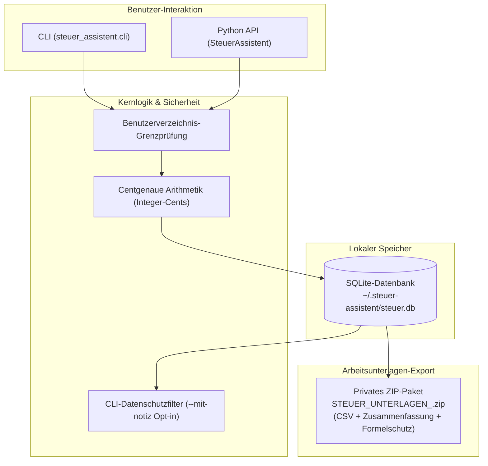

# steuer-assistent

[🇬🇧 English Version](README.md)

[](https://github.com/ellmos-ai/steuer-assistent/actions/workflows/tests.yml)
[](https://www.python.org/downloads/)
[](https://opensource.org/licenses/MIT)
[](#store-und-datenschutz)
[](#rechtlicher-rahmen-und-betriebsform)

*Lokale Beleg-Arbeitsunterlage für Arbeitnehmer-Werbungskosten — keine Steuerberatung.*

Ein leichtgewichtiges, Offline-First-Python-Modul zur lokalen Erfassung von selbst eingeordneten Belegen für Arbeitnehmer-Werbungskosten, centgenauer Summierung und dem Export privater, nicht-amtlicher ZIP-Arbeitsunterlagen. Es prüft weder die steuerliche Abziehbarkeit noch erstellt oder übermittelt es eine Steuererklärung.

Die offizielle elektronische Übermittlung erfolgt über ELSTER beziehungsweise dafür zugelassene Software. ELSTER weist außerdem darauf hin, dass bloß in „Meine Belege“ erfasste Dokumente noch nicht an das Finanzamt übermittelt sind:
[ELSTER-Belegverwaltung](https://portal.elster.de/eportal/helpGlobal?themaGlobal=help_meine_belege),
[ELSTER-Belegnachreichung](https://www.elster.de/eportal/formulare-leistungen/alleformulare/belegnachreichung).

> [!NOTE]
> **Offline-First & Lokale Architektur**: `steuer-assistent` ist ein reines Offline-Arbeitsunterlagenmodul (`~/.steuer-assistent/steuer.db`). Keine Netzwerkaufrufe, keine Cloud-Abhängigkeiten, centgenaue Arithmetik (Integer-Cents) und datenschutzfreundliche Standardeinstellungen in der Befehlszeile.

## Architektur



## Funktionsübersicht

| Funktion | Beschreibung |
|---|---|
| **Offline-First & Lokal** | Datenbank ausschließlich im Benutzerverzeichnis (`%USERPROFILE%\.steuer-assistent\steuer.db`). Keine Netzwerkverbindung. |
| **Centgenaue Arithmetik** | Beträge werden intern als Integer-Cents gespeichert, um Fließkomma-Rundungsfehler auszuschließen. |
| **Datenschutz-CLI** | Notizen und absolute Pfade werden in der Konsole standardmäßig ausgeblendet und erfordern ein explizites Opt-in (`--mit-notiz`, `--mit-pfad`). |
| **Arbeitsunterlagen-Export** | Erstellt `STEUER_UNTERLAGEN_<jahr>.zip` mit CSV (UTF-8 BOM), strukturierter Text-Zusammenfassung & CSV-Formelschutz. Überschreibt niemals bestehende Exporte. |
| **Standardkonform** | Benötigt nur Python 3.10+ und die Standardbibliothek (`sqlite3`). Keine externen Drittanbieter-Abhängigkeiten. |

## Verwendung

### Befehlszeile (CLI)

| Aktion | Befehl |
|---|---|
| Beleg erfassen | `python -m steuer_assistent.cli add --kategorie Arbeitsmittel --betrag 49.90 --datum 2026-03-15 --notiz "USB-Hub"` |
| Belege ohne Notizen anzeigen | `python -m steuer_assistent.cli list` |
| Notizen bewusst anzeigen | `python -m steuer_assistent.cli list --mit-notiz` |
| Erfasste Werbungskosten summieren | `python -m steuer_assistent.cli werbungskosten --jahr 2026` |
| Private Arbeitsunterlage exportieren | `python -m steuer_assistent.cli export --jahr 2026` |
| Status ohne Store-Pfad anzeigen | `python -m steuer_assistent.cli status` |
| Status mit vollständigem Pfad | `python -m steuer_assistent.cli status --mit-pfad` |

Der Standardexport heißt `STEUER_UNTERLAGEN_<jahr>.zip`. Vorhandene Zieldateien werden nicht überschrieben (kein unbemerktes Überschreiben). Das ZIP enthält CSV, Text-Zusammenfassung und einen rechtlichen Hinweis zur Nicht-Amtlichkeit, aber keine eigentlichen Belegdateien.

### Python-API

```python
from steuer_assistent.core import SteuerAssistent

with SteuerAssistent() as sa:
    # Beleg erfassen
    sa.add_beleg(
        kategorie="Arbeitsmittel",
        betrag=49.90,
        datum="2026-03-15",
        notiz="USB-Hub",
    )

    # Erfasste Werbungskosten abfragen
    agg = sa.get_werbungskosten(jahr=2026)
    print(f"Gesamtsumme 2026: {agg['gesamt_eur']:.2f} EUR")

    # Private Arbeitsunterlage als ZIP exportieren
    export_zip = sa.export_arbeitsunterlage(jahr=2026)
    print(f"Exportiert nach: {export_zip}")
```

## Store und Datenschutz

- **Standardpfad**: `%USERPROFILE%\.steuer-assistent\steuer.db`
- **Konfigurations-Override**: Umgebungsvariable `STEUER_ASSISTENT_DB=<Pfad>` oder CLI-Argument `--store <Pfad>`
- **Pfadsicherheit**: Store, verknüpfte Belegpfade und Export-Ziele müssen strikt im Benutzerverzeichnis liegen (`_require_user_path`).
- **Geld-Speicherung**: Beträge werden intern als Integer-Cents gespeichert (`betrag_cent`); vorhandene Altdaten werden automatisch migriert.
- **CLI-Redaktion**: Vertrauliche Notizen und absolute Dateipfade erscheinen in der CLI nur bei ausdrücklichem Opt-in.
- **Berechtigungen**: Das Modul setzt restriktive Dateirechte (`0600`/`0700` auf POSIX); unter Windows gelten die NTFS-Benutzerprofilrechte.
- **Isolierung**: Keine Netzwerkverbindung, kein Cloud-Upload, kein Zugriff auf `bach.db`.

Tabellenstruktur: `belege`, `beleg_sequences`, `werbungskosten_kategorien`, `export_runs`.

## Installation und Prüfung

```powershell
cd steuer-assistent
python -m pip install -e .
python -B -m pytest tests -q -p no:cacheprovider
```

## Grenzen

- **Scope**: Private Arbeitsunterlage für Arbeitnehmer-Werbungskosten; kein Gewerbe-/Betriebsausgaben-Workflow.
- **Keine Steuerberatung**: Keine Rechtsprüfung, keine Anerkennungsbewertung und keine rechtliche Beratung.
- **Kein amtliches Format**: Kein ELSTER-, ERiC- oder Finanzamt-Übermittlungsformat.
- **Keine Übermittlung**: Keine direkte Beleg- oder Steuerdatenübermittlung an Behörden.
- **Eigenständigkeit**: Reine Standardbibliothek, keine Laufzeitabhängigkeit zu externen Frameworks.

## Rechtlicher Rahmen und Betriebsform

**Keine Steuerberatung.** Dieses Modul ist ein reines Selbstanwendungs-Werkzeug: Es erfasst und summiert vom Nutzer selbst eingeordnete Belege, trifft aber keine steuerliche Bewertung und übernimmt keine Gewähr für ein steuerliches Ergebnis. Nutzung erfolgt auf eigene Verantwortung; die Gewährleistung richtet sich — unabhängig vom MIT-Lizenztext — nach dem gesetzlich zwingenden Umfang (Vorsatz und grobe Fahrlässigkeit bleiben nach deutschem Recht stets haftungsbewehrt, siehe §§ 276 Abs. 3, 309 Nr. 7 lit. b BGB).

KI-gestützte Ersteinschätzung (kein Ersatz für anwaltliche Beratung, nicht abschließend anwaltlich geprüft), Stand 2026-07-23: Für die aktuelle Betriebsform — reine Selbstanwendung auf lokal gehaltene, vom Nutzer selbst eingeordnete Daten, ohne Netzwerkverbindung, ohne Rechtsprüfung des Einzelfalls — ist dieses Modul nach den einschlägigen Vorschriften des Steuerberatungsgesetzes (StBerG, insbes. § 2 Abs. 2) und des Rechtsdienstleistungsgesetzes (RDG, insbes. § 2 Abs. 1) keine „geschäftsmäßige Hilfeleistung in Steuersachen“ bzw. Rechtsdienstleistung. Grundlage ist eine vertiefte interne Prüfung (StBerG, RDG, UWG, BGB, DSGVO, mit Rechtsprechungsschicht und Fremdmodell-Review); sie ist nicht Teil dieses Repositories.

**Diese Einschätzung gilt nur für die beschriebene Betriebsform.** Eine erneute rechtliche Prüfung ist nötig, sobald sich die Betriebsform ändert — insbesondere bei:

1. **automatischer steuerlicher Einordnung oder Würdigung** durch das Tool selbst (statt reiner Nutzereingabe),
2. **Hosting- oder Servicebetrieb**, oder Bearbeitung fremder Belege durch den Betreiber (statt lokaler Selbstanwendung),
3. **ELSTER-, ERiC- oder sonstiger amtlicher Übermittlungsanbindung**,
4. **entgeltlicher Vermarktung** dieses Moduls oder einer daraus abgeleiteten Voll-Pipeline (z. B. „steuer-suite“),
5. **Cloud-Sync oder sonstiger Veröffentlichung erfasster Nutzerdaten durch den Nutzer selbst** (z. B. öffentliches Repository der eigenen Datenbank) — die DSGVO-Haushaltsausnahme (Art. 2 Abs. 2 lit. c DSGVO) kann dann beim jeweiligen Nutzer entfallen,
6. **Installation auf Firmen-/BYOD-Rechnern zur Abrechnung dienstlicher (fremder) Spesen** — auch hier kann die DSGVO-Haushaltsausnahme beim Nutzer entfallen, unabhängig vom Autor.

Bei Zweifeln oder vor produktivem Einsatz mit echten Steuerdaten Dritter empfiehlt sich eine unabhängige anwaltliche Prüfung.

## Herkunft

- **Ursprung**: Extrahiert aus BACH `agents/_experts/steuer/` (MIT)
- **Extraktionsdatum**: 2026-06-22
- **Lizenz**: MIT

## Lizenz

MIT — siehe [`LICENSE`](LICENSE). Änderungen: siehe [`CHANGELOG.md`](CHANGELOG.md).
Sicherheitsmeldungen: siehe [`SECURITY.md`](SECURITY.md).
